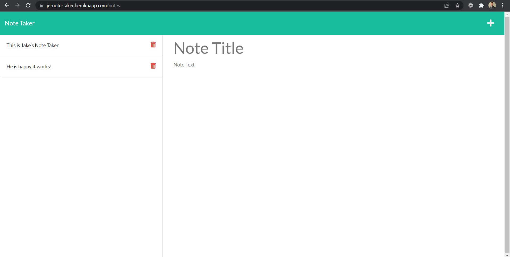

# Express Note Taker

# Description

This app allows the user to write and save notes using an Express.js back end and data from a JSON file.

# Table of Contents

[Installation](#instructions)

[Usage](#usage)

[Contributing](#contributing)

[Tests](#tests)

[Questions](#questions)

[License](#license)

# Installation

After you have cloned the repository, npm i will install all the necessary dependencies.

# Usage

This app is used to write and save notes that will be stored on a heroku server using Express.js and a JSON file.

# Contributing

I am the only contributor at this point.

# Tests

No testing was implemented for this project.

# Questions

My Github username is jakeeis24

Link to my Github profile: https://github.com/jakeeis24

Questions? Email me: jakeeissler1@gmail.com

# License

No license associated with this repository.
